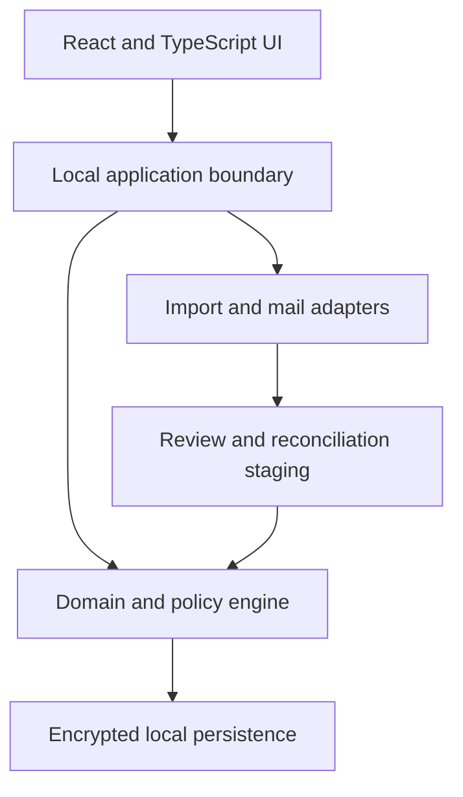
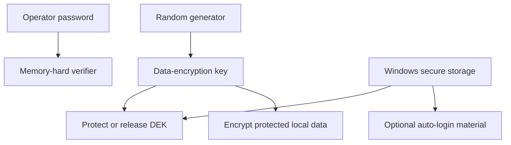

# SOMA Beta High-Level Architecture

Status: **HLD foundation v0.3**. This document establishes boundaries and quality attributes. It intentionally does not select a final database schema, cryptographic library, PST/OST adapter, or packaging implementation; those belong to low-level design and architecture decision records.

## 1. Architectural drivers

1. Fully local and offline operation.
2. One authenticating operator per installation.
3. Protection of all persisted operational data, including working files and backups.
4. Source-aware imports that cannot erase SOMA-owned meaning.
5. Strong identity, history, and audit semantics across tickets, work, inventory, and infrastructure.
6. Responsive Windows-focused experience with no Node.js runtime required for the installed user.
7. Nearly dependency-free: use few, justified, pinned libraries and keep domain behavior SOMA-owned.

## 2. Logical shape

The browser UI is a client of a local application boundary. Domain rules do not live only in UI components or import parsers. Imports first produce staged proposals; accepted proposals pass through the same domain policies as manual changes.

## 3. Product modules

| Module | Owns |
|---|---|
| Identity and Settings | Local User Profile, registered people, installation configuration, themes |
| Tickets | SRs, RFCs, hierarchy, workbench device references, Contract Product Line classification, source observations |
| Objectives | Maintenance Windows, Local/WFM Tasks, RFC branches, scheduling, planned/actual time, review and attempts |
| Inventory | Stock, BOM catalog, SR-level Spare Needs, Device Part Units, Spare Requests, RMA obligations, Spare Part Units, requested and actual logistics, Task outcomes, Fault Tag identities and memberships, pickup-origin snapshots, warehouse decisions, replacement/resend lineage, proposals, bulk actions, correction, and removal |
| Infrastructure | customer-owned Sites, reusable Cloud Types, site-bound Cloud Deployments, device models and instances, installed components, replacement history |
| SLA Policy | Customer-owned Contracts, reusable Product Lines, Contract Product Lines, cohort tiers, suspension, endpoints, derived results, warnings |
| Overview and Reporting | curated metrics, narrative queues, filters, Excel snapshots |
| Import/Reconciliation | source adapters, provenance, diffs, safe auto-accept policy |
| Offline Communications | read-only PST/OST indexing and MSG draft generation |
| Audit | accepted facts, manual changes, relationship history, destructive impact records |

Modules may share identifiers and domain events through explicit interfaces. They must not mutate each other’s tables or files through undocumented shortcuts.

## 4. Persistence model

The clean Beta schema must distinguish:

- stable local identity from external/official identity;
- current accepted facts from source observations and import proposals;
- SOMA-owned relationships/notes from source-owned population fields;
- exact two-level RFC hierarchy and derived master/subordinate WFM roles;
- Objective identity from Task identity and Task-derived SR context;
- Local Task many-to-many context—including master or subordinate RFC links—from WFM Task single-RFC ownership;
- planned Objective time from actual execution evidence;
- SR-level Spare Need demand from matching Device Part Unit contributors across the Service Request;
- available Stock suggestions from physical-unit condition, location, reservation, compatibility, and disposition;
- submitted request quantity from local-Stock allocations, external-request allocations, and immutable submission evidence;
- promised RMA BOM from actual inbound, installed, removed, and return-unit BOM/serial facts;
- physical unit identity from optional manufacturer serial and catalog/BOM identity;
- unregistered device references from promoted Infrastructure Network Elements without duplicating their operational relationships;
- Device Part Units from Inventory Spare Part Units, even when one replaces the other;
- RMA obligation state from target assignment, direct inbound unit, Task outcome, return-unit selection, Fault Tag, warehouse receipt, and final acceptance/rejection;
- RMA origin provenance from direct-fulfillment identity for dismantled assemblies and their extracted component units;
- reusable Product Line identity from Customer-owned Contract Product Lines and their independent SLA policies;
- Customer Organization ownership of Sites, reusable Cloud Types, site-bound Cloud Deployments, and optional provisional Device placement;
- current device composition from immutable installation/replacement events; and
- current individual elapsed-time evidence and cohort SLA/reporting results from the accepted facts and latest Contract Product Line policy, while completed report snapshots retain the policy revision and results captured at completion.

Beta owns an independent migration lineage; Alpha migrations, ledgers, and table layouts are historical input and are never an executable starting point. The Beta persistence model explicitly separates import attempts, staging, accepted runs and compact observations, current projections, domain lifecycle evidence, general audit, report attempts, and completed report snapshots. It contains no structure whose sole purpose is Alpha report finalization or purge authorization.

Migration drafts may be revised until accepted. An accepted migration's identity, order, content, and integrity evidence are immutable; later corrections are forward-only. Applying schema changes and recording their ledger evidence is atomic, and startup fails safely before serving when accepted migration integrity is not satisfied. Exact numbering, checksum, locking, and recovery mechanics belong in the LLD.

Reporting reads one consistent accepted-state snapshot and writes data-minimized durable evidence only after the Excel artifact is verified. Failed or cancelled generation retains at most bounded attempt diagnostics and cannot mutate operational state. Completed snapshots are immutable historical evidence rather than cleanup authorization.

Operational persistence has no report-, status-, disappearance-, age-, or timer-driven finalization/minimization path in Beta 1.0. Historical views are projections over surviving records. Technical cache reconstruction, staging cleanup, diagnostic-log rotation, and backup rotation use separate policies and cannot delete authoritative operational history.

No Beta 1.0 scheduler computes an operational retention due time or purge eligibility. Main-view period selection is a query/presentation concern. Any future operational retention service is installation-level, version-gated, and requires its own accepted dependency, exception/hold, recovery, and audit design.

Audit history is a first-class persistence concern. Hard deletion is a narrow operation for untouched manual records only. Imported/adopted or operationally evidenced records transition through archive, termination, cancellation, replacement, and append-only correction so their material effects remain explainable.

Inventory persistence separates immutable entity identity, accepted lifecycle events, current projections, relationship history, proposal decisions, bulk-batch identity, requested-logistics snapshots, shared actual-logistics events, and per-target participation. Fault Tag persistence additionally separates tag and membership identity, derived RMA/ticket/Device context, immutable submitted display snapshots, conditional pickup-origin snapshots, per-membership warehouse events, and typed correction-replacement versus resend lineage. A correction targets an exact event or relationship and recomputes the projection without rewriting entity identity or original evidence.

## 5. Local security envelope

The login password is authentication material only. It is never used directly or indirectly to encrypt data, wrap encryption keys, or protect backups, and it is never stored in plaintext.

The live security envelope covers the database, journals/WAL, temporary persistence, sensitive retained imports, communication indexes, and support artifacts containing operational data. A cryptographically random data-encryption key is protected through approved Windows-bound secure storage independently of the SOMA password. Automatic login stores only Windows-protected authentication material; disabling it removes that convenience without changing live-data encryption.

Exportable backups use a separate random backup-encryption key and authenticated encryption. Portable recovery uses a generated high-entropy recovery secret, recommended as seven random words or an equivalent secret of at least 128 bits. Hashes verify integrity and do not substitute for encryption. The exact algorithms, password-verifier parameters, Windows protection API, encrypted-database implementation, recovery-secret encoding, key rotation, and restore mechanics are LLD decisions and require threat-model review. Established cryptographic libraries must be used; custom cryptography is prohibited.

Managed backup retention defaults to five and is configurable to another positive finite count. A replacement is authenticated, integrity-checked, and verified as structurally restorable before pruning an older managed copy; rotation never removes the last verified restorable copy and never automatically deletes portable backups in operator-selected locations. Managed backup rotation is separate from operational-history retention.

## 6. Import architecture

Every source adapter produces a staged normalized source observation with source file identity, import run, row locator, external identity, parsed allowlisted values, and validation findings. Acceptance updates the current projection field by field and persists only compact meaningful deltas, necessary provenance, and warnings. The [Import Contract](IMPORT_CONTRACT.md) is the authority for retained fields; adapters may not persist discarded columns, complete workbook copies, or repeated unchanged values as generic metadata.

The reconciliation pipeline:

1. parses without modifying domain records;
2. validates format and identity;
3. matches by immutable official identity;
4. calculates a field-level proposal against accepted source-owned facts;
5. classifies safe, warning, and high-risk changes;
6. applies only accepted proposals through domain policies; and
7. records provenance and the operator/auto-accept rule used.

The operator may configure auto-accept only for explicitly safe source/change classes. High-risk classes in the product contract cannot be bypassed.

Every staged run exposes a proposal-oriented impact summary before mutation. Source profiles declare whether and for what scope absence has meaning. An empty authoritative population with prior in-scope records requires confirmation bound to the exact source identity and cannot auto-accept; acceptance remains nondestructive. Population and Customer Organization distribution comparisons are observable inputs in 1.0, not unvalidated automatic thresholds.

The local application shell owns scheduled Advanced Search invocation and satisfied-boundary persistence. After inbox configuration it supports the accepted daily default, operator configuration/disablement, a single missed-boundary startup catch-up, and an always-available manual check. Scheduling only invokes discovery and staging; it never bypasses domain reconciliation policy.

## 7. Workbench and reference promotion

The Service Request and RFC workbenches are projections over shared domain identities, not private copies of devices, Tasks, RFCs, spares, or notes. Their exact interaction contract is defined in [Ticket and Objective Workbench Contract](WORKBENCH_CONTRACT.md).

An unregistered device reference is owned by the operational context that first records it and can be used immediately across Tickets, Objectives, and Inventory. Promotion through the deliberate three-second control creates or links one Infrastructure Network Element in a transaction that preserves and repoints existing relationships. Promotion cannot produce a second operational device for the same reference.

Objective grouping is a domain policy, not a calendar-only UI behavior. It evaluates accepted Task intervals, prohibits accepted overlapping Objectives, stages consolidation when a Task bridges groups, and keeps Tasks without complete intervals unscheduled.

## 8. Offline communication architecture

PST/OST access is read-only and adapter-isolated. The index is locally encrypted and reproducible from the store. File lock, corruption, unsupported format, or partial parse produces a bounded error and never modifies the source store. Inventory communication matches create idempotent review proposals for Spare Request or Fault Tag submission, SR7/C10 acknowledgement, incremental positions, dispatch, actual pickup, warehouse receipt, and final decisions; they never mutate domain state before acceptance. Proposal identity, source communication, candidate memberships, acceptance or rejection, and later correction remain distinct. Final warehouse acceptance or rejection always requires explicit operator confirmation.

MSG output is a generated draft artifact. Saving a Spare Request, generating its `.msg`, accepting indexed sent evidence, and manually recording a submission initiated outside SOMA are distinct commands; external registration creates the normal internal and temporary request identities. Draft generation never proves sending or starts a response timer. No direct SMTP, Exchange, Graph, IMAP, or cloud mail integration exists in 1.0.0. The persistence and application-service boundary accepts optional evidence references from supported adapters, but Beta 1.0 exposes no manual attachment or upload control anywhere in the UI; manual lifecycle actions remain valid without evidence.

Overview and Needs Attention are the authoritative continuous warning projection. Supplemental local in-app or tray notifications are a deduplicated projection of active conditions, limited to once per Service Request and condition per operator-local calendar day across restarts. Recognized terminal SR status suppresses active-work and live SLA-risk notifications without removing historical evidence.

## 9. Dependency policy

“Nearly dependency-free” means:

- domain rules and transformations remain specific, readable SOMA code;
- each dependency must provide a concrete capability that is expensive or unsafe to recreate;
- production dependencies are few, pinned, auditable, and wrapped by narrow adapters;
- no framework is allowed to redefine the domain model;
- cryptography, Excel, and PST/OST parsing use established libraries rather than home-grown implementations; and
- React/TypeScript and Node tooling are build/development concerns; Node is not an installed end-user runtime.

A local Python runtime and local web UI are the current direction. The exact supported Python, Windows, and browser matrix remains open until packaging and adapter feasibility are validated.

## 10. Release boundaries

1.0.0 includes all six modules, the stock-first Inventory, SR-level Need aggregation, Spare Request/RMA obligation/Task outcome/Fault Tag and warehouse-loop lifecycles, pickup-origin and actual logistics, cross-request membership, correction replacement, rejection resend, state-specific removal, external request registration, reviewed proposals, compatible bulk actions, exact-event correction, security, official imports, Excel reporting, SLA, PST/OST read, MSG drafts, responsive themes, and tray behavior.

1.x.0 may add SSH/device operations, connectivity/topology, and language switching. Shared multi-user databases, direct email, cloud services, arbitrary report builders, and Alpha database migration require a later product decision.
