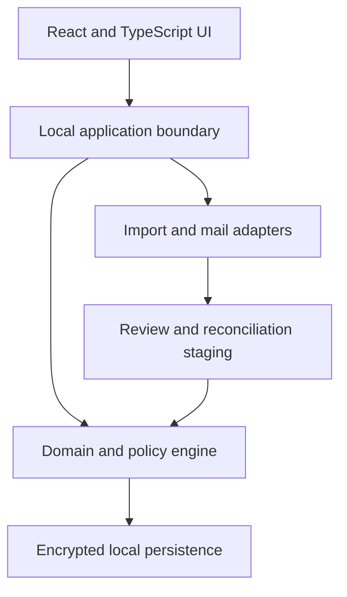
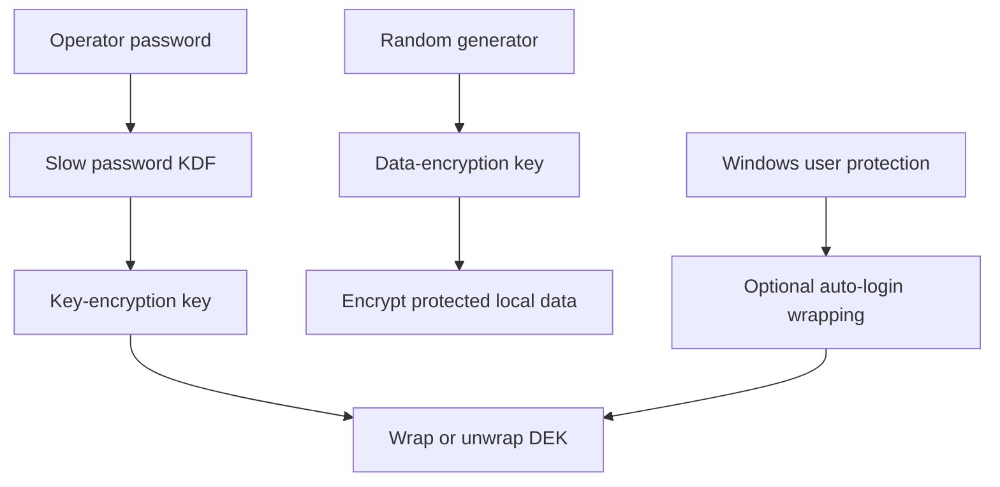

# SOMA Beta High-Level Architecture

Status: **HLD foundation v0.1**. This document establishes boundaries and quality attributes. It intentionally does not select a final database schema, cryptographic library, PST/OST adapter, or packaging implementation; those belong to low-level design and architecture decision records.

## 1. Architectural drivers

1. Fully local and offline operation.
2. One authenticating operator per installation.
3. Protection of all persisted operational data, including working files and backups.
4. Source-aware imports that cannot erase SOMA-owned meaning.
5. Strong identity, history, and audit semantics across tickets, work, inventory, and infrastructure.
6. Responsive Windows-focused experience with no Node.js runtime required for the installed user.
7. Nearly dependency-free: use few, justified, pinned libraries and keep domain behavior SOMA-owned.

## 2. Logical shape

The browser UI is a client of a local application boundary. Domain rules do not live only in UI components or import parsers. Imports first produce staged proposals; accepted proposals pass through the same domain policies as manual changes.

## 3. Product modules

| Module | Owns |
|---|---|
| Identity and Settings | Local User Profile, registered people, installation configuration, themes |
| Tickets | SRs, RFCs, hierarchy, Product Line assignment, source observations |
| Objectives | Maintenance Windows, Tasks, WFM scheduling, task review and attempts |
| Inventory | BOM catalog, Spare Needs, Spare Requests, RMAs, serialized units, logistics |
| Infrastructure | customer/cloud/site hierarchy, device models and instances, installed components, replacement history |
| SLA Policy | milestone policies, suspension, endpoint, derived state, cohorts, warnings |
| Overview and Reporting | curated metrics, narrative queues, filters, Excel snapshots |
| Import/Reconciliation | source adapters, provenance, diffs, safe auto-accept policy |
| Offline Communications | read-only PST/OST indexing and MSG draft generation |
| Audit | accepted facts, manual changes, relationship history, destructive impact records |

Modules may share identifiers and domain events through explicit interfaces. They must not mutate each other’s tables or files through undocumented shortcuts.

## 4. Persistence model

The clean Beta schema must distinguish:

- stable local identity from external/official identity;
- current accepted facts from source observations and import proposals;
- SOMA-owned relationships/notes from source-owned population fields;
- physical unit identity from catalog/BOM identity;
- RMA logistics state from unit condition and location;
- current device composition from immutable installation/replacement events; and
- derived SLA/reporting state from the accepted facts used to calculate it.

Audit history is a first-class persistence concern. Cascades may remove active records only under the product contract; their material effects remain explainable.

## 5. Local security envelope

The login password is never used directly as an encryption key and is never stored in plaintext.

The security envelope covers the database, journals/WAL, temporary persistence, backups, sensitive retained imports, communication indexes, and support artifacts containing operational data. Automatic login stores only a Windows-user-protected wrapped key. Disabling it removes that convenience wrapper, not the encrypted data.

The exact algorithms, KDF parameters, key rotation/recovery behavior, export protection, and Windows protection API are LLD decisions and require threat-model review. Established cryptographic libraries must be used; custom cryptography is prohibited.

## 6. Import architecture

Every source adapter produces a normalized source observation with source file identity, import run, row locator, external identity, parsed values, and validation findings.

The reconciliation pipeline:

1. parses without modifying domain records;
2. validates format and identity;
3. matches by immutable official identity;
4. calculates a field-level proposal against accepted source-owned facts;
5. classifies safe, warning, and high-risk changes;
6. applies only accepted proposals through domain policies; and
7. records provenance and the operator/auto-accept rule used.

The operator may configure auto-accept only for explicitly safe source/change classes. High-risk classes in the product contract cannot be bypassed.

## 7. Offline communication architecture

PST/OST access is read-only and adapter-isolated. The index is locally encrypted and reproducible from the store. File lock, corruption, unsupported format, or partial parse produces a bounded error and never modifies the source store.

MSG output is a generated draft artifact. The domain records draft generation separately from sent evidence. No direct SMTP, Exchange, Graph, IMAP, or cloud mail integration exists in 1.0.0.

## 8. Dependency policy

“Nearly dependency-free” means:

- domain rules and transformations remain specific, readable SOMA code;
- each dependency must provide a concrete capability that is expensive or unsafe to recreate;
- production dependencies are few, pinned, auditable, and wrapped by narrow adapters;
- no framework is allowed to redefine the domain model;
- cryptography, Excel, and PST/OST parsing use established libraries rather than home-grown implementations; and
- React/TypeScript and Node tooling are build/development concerns; Node is not an installed end-user runtime.

A local Python runtime and local web UI are the current direction. The exact supported Python, Windows, and browser matrix remains open until packaging and adapter feasibility are validated.

## 9. Release boundaries

1.0.0 includes all six modules, security, official imports, Excel reporting, SLA, PST/OST read, MSG drafts, responsive themes, and tray behavior.

1.x.0 may add SSH/device operations, connectivity/topology, and language switching. Shared multi-user databases, direct email, cloud services, arbitrary report builders, and Alpha database migration require a later product decision.
