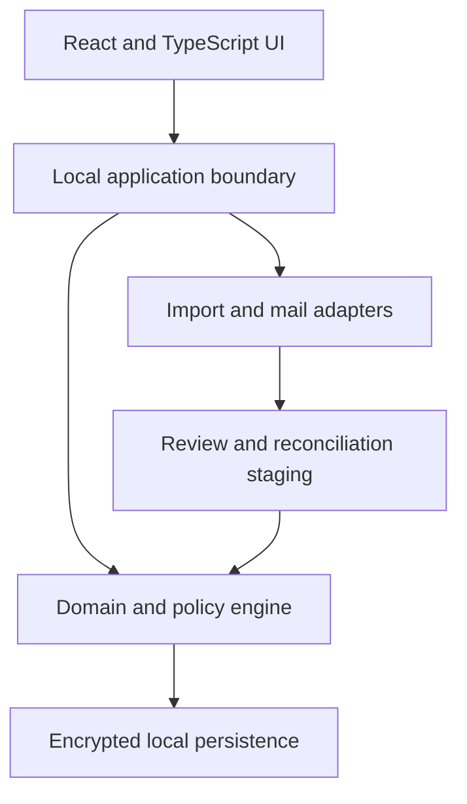
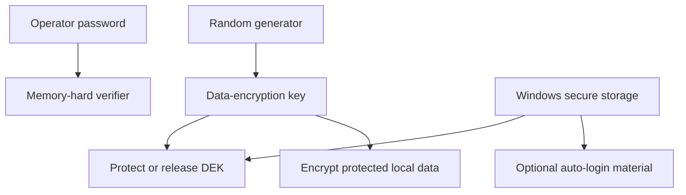

# SOMA Beta High-Level Architecture

Status: **HLD foundation v0.3**. This document establishes boundaries and quality attributes. It intentionally does not select a final database schema, cryptographic library, PST/OST adapter, or packaging implementation; those belong to low-level design and architecture decision records.

## 1. Architectural drivers

1. Fully local and offline operation.
2. One authenticating operator per installation.
3. Protection of all persisted operational data, including working files and backups.
4. Source-aware imports that cannot erase SOMA-owned meaning.
5. Strong identity, history, and audit semantics across tickets, work, inventory, and infrastructure.
6. Responsive Windows-focused experience with no Node.js runtime required for the installed user.
7. Nearly dependency-free: use few, justified, pinned libraries and keep domain behavior SOMA-owned.

## 2. Logical shape

The browser UI is a client of a local application boundary. Domain rules do not live only in UI components or import parsers. Imports first produce staged proposals; accepted proposals pass through the same domain policies as manual changes.

## 3. Product modules

| Module | Owns |
|---|---|
| Identity and Settings | Local User Profile, registered people, installation configuration, themes |
| Tickets | SRs, RFCs, hierarchy, workbench device references, Contract Product Line classification, source observations |
| Objectives | Maintenance Windows, Local/WFM Tasks, RFC branches, scheduling, planned/actual time, review and attempts |
| Inventory | Stock, BOM catalog, Spare Needs, Spare Requests, RMAs, physical units, Fault Parts, Fault Tags and logistics |
| Infrastructure | customer-owned Sites, reusable Cloud Types, site-bound Cloud Deployments, device models and instances, installed components, replacement history |
| SLA Policy | Contracts, Contract Product Lines, cohort tiers, suspension, endpoints, derived results, warnings |
| Overview and Reporting | curated metrics, narrative queues, filters, Excel snapshots |
| Import/Reconciliation | source adapters, provenance, diffs, safe auto-accept policy |
| Offline Communications | read-only PST/OST indexing and MSG draft generation |
| Audit | accepted facts, manual changes, relationship history, destructive impact records |

Modules may share identifiers and domain events through explicit interfaces. They must not mutate each other’s tables or files through undocumented shortcuts.

## 4. Persistence model

The clean Beta schema must distinguish:

- stable local identity from external/official identity;
- current accepted facts from source observations and import proposals;
- SOMA-owned relationships/notes from source-owned population fields;
- exact two-level RFC hierarchy and derived master/subordinate WFM roles;
- Objective identity from Task identity and Task-derived SR context;
- Local Task many-to-many context—including master or subordinate RFC links—from WFM Task single-RFC ownership;
- planned Objective time from actual execution evidence;
- requested quantity/position outcomes from accepted C10 RMA positions;
- requested BOM from actual received BOM and compatibility acceptance;
- physical unit identity from optional manufacturer serial and catalog/BOM identity;
- unregistered device references from promoted Infrastructure Network Elements without duplicating their operational relationships;
- Spare Needs from actual Fault Parts and one-to-one replacement counterparts;
- RMA logistics state from unit condition and location;
- Customer Organization ownership of Sites, reusable Cloud Types, site-bound Cloud Deployments, and optional provisional Device placement;
- current device composition from immutable installation/replacement events; and
- individual elapsed-time evidence and cohort SLA/reporting results from the accepted facts and Contract Product Line policy used to calculate them.

Audit history is a first-class persistence concern. Hard deletion is a narrow operation for untouched manual records only. Imported/adopted or operationally evidenced records transition through archive, termination, cancellation, replacement, and append-only correction so their material effects remain explainable.

## 5. Local security envelope

The login password is authentication material only. It is never used directly or indirectly to encrypt data, wrap encryption keys, or protect backups, and it is never stored in plaintext.

The live security envelope covers the database, journals/WAL, temporary persistence, sensitive retained imports, communication indexes, and support artifacts containing operational data. A cryptographically random data-encryption key is protected through approved Windows-bound secure storage independently of the SOMA password. Automatic login stores only Windows-protected authentication material; disabling it removes that convenience without changing live-data encryption.

Exportable backups use a separate random backup-encryption key and authenticated encryption. Portable recovery uses a generated high-entropy recovery secret, recommended as seven random words or an equivalent secret of at least 128 bits. Hashes verify integrity and do not substitute for encryption. The exact algorithms, password-verifier parameters, Windows protection API, encrypted-database implementation, recovery-secret encoding, key rotation, and restore mechanics are LLD decisions and require threat-model review. Established cryptographic libraries must be used; custom cryptography is prohibited.

## 6. Import architecture

Every source adapter produces a normalized source observation with source file identity, import run, row locator, external identity, parsed allowlisted values, and validation findings. The [Import Contract](IMPORT_CONTRACT.md) is the authority for retained fields; adapters may not persist discarded columns as generic metadata.

The reconciliation pipeline:

1. parses without modifying domain records;
2. validates format and identity;
3. matches by immutable official identity;
4. calculates a field-level proposal against accepted source-owned facts;
5. classifies safe, warning, and high-risk changes;
6. applies only accepted proposals through domain policies; and
7. records provenance and the operator/auto-accept rule used.

The operator may configure auto-accept only for explicitly safe source/change classes. High-risk classes in the product contract cannot be bypassed.

## 7. Workbench and reference promotion

The Service Request and RFC workbenches are projections over shared domain identities, not private copies of devices, Tasks, RFCs, spares, or notes. Their exact interaction contract is defined in [Ticket and Objective Workbench Contract](WORKBENCH_CONTRACT.md).

An unregistered device reference is owned by the operational context that first records it and can be used immediately across Tickets, Objectives, and Inventory. Promotion through the deliberate three-second control creates or links one Infrastructure Network Element in a transaction that preserves and repoints existing relationships. Promotion cannot produce a second operational device for the same reference.

Objective grouping is a domain policy, not a calendar-only UI behavior. It evaluates accepted Task intervals, prohibits accepted overlapping Objectives, stages consolidation when a Task bridges groups, and keeps Tasks without complete intervals unscheduled.

## 8. Offline communication architecture

PST/OST access is read-only and adapter-isolated. The index is locally encrypted and reproducible from the store. File lock, corruption, unsupported format, or partial parse produces a bounded error and never modifies the source store.

MSG output is a generated draft artifact. The domain records draft generation separately from sent evidence. No direct SMTP, Exchange, Graph, IMAP, or cloud mail integration exists in 1.0.0.

## 9. Dependency policy

“Nearly dependency-free” means:

- domain rules and transformations remain specific, readable SOMA code;
- each dependency must provide a concrete capability that is expensive or unsafe to recreate;
- production dependencies are few, pinned, auditable, and wrapped by narrow adapters;
- no framework is allowed to redefine the domain model;
- cryptography, Excel, and PST/OST parsing use established libraries rather than home-grown implementations; and
- React/TypeScript and Node tooling are build/development concerns; Node is not an installed end-user runtime.

A local Python runtime and local web UI are the current direction. The exact supported Python, Windows, and browser matrix remains open until packaging and adapter feasibility are validated.

## 10. Release boundaries

1.0.0 includes all six modules, Inventory Stock/Spare Request/Fault Tag lifecycles, security, official imports, Excel reporting, SLA, PST/OST read, MSG drafts, responsive themes, and tray behavior.

1.x.0 may add SSH/device operations, connectivity/topology, and language switching. Shared multi-user databases, direct email, cloud services, arbitrary report builders, and Alpha database migration require a later product decision.
