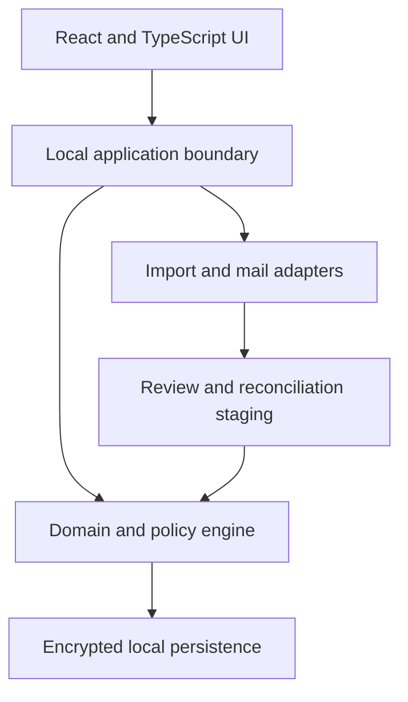
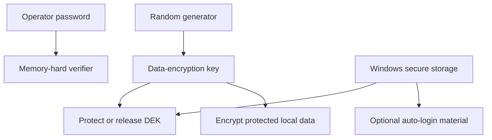

# SOMA Beta High-Level Architecture

Status: **HLD foundation v0.3**. This document establishes boundaries and quality attributes. It intentionally does not select a final database schema, cryptographic library, PST/OST adapter, or packaging implementation; those belong to low-level design and architecture decision records.

## 1. Architectural drivers

1. Fully local and offline operation.
2. One authenticating operator per installation.
3. Protection of all persisted operational data, including working files and backups.
4. Source-aware imports that cannot erase SOMA-owned meaning.
5. Strong identity, history, and audit semantics across tickets, work, inventory, and infrastructure.
6. Responsive Windows-focused experience with no Node.js runtime required for the installed user.
7. Nearly dependency-free: use few, justified, pinned libraries and keep domain behavior SOMA-owned.

## 2. Logical shape

The browser UI is a client of a local application boundary. Domain rules do not live only in UI components or import parsers. Imports first produce staged proposals; accepted proposals pass through the same domain policies as manual changes.

## 3. Product modules

| Module | Owns |
|---|---|
| Identity and Settings | Local User Profile, registered people, installation configuration, themes |
| Tickets | SRs, RFCs, hierarchy, workbench device references, Contract Product Line classification, source observations |
| Objectives | Maintenance Windows, Local/WFM Tasks, RFC branches, scheduling, planned/actual time, review and attempts |
| Inventory | Stock, BOM catalog, SR-level Spare Needs, Device Part Units, Spare Requests, RMA obligations, Spare Part Units, requested and actual logistics, Task outcomes, Fault Tag identities and memberships, pickup-origin snapshots, warehouse decisions, replacement/resend lineage, proposals, bulk actions, correction, and removal |
| Infrastructure | customer-owned Sites; Rooms/Racks; reusable Cloud Types and site-bound Deployments; Device References; Network Element models, instances, IP inventory, containment, placement, installed components, replacement history, and reviewed workbook exchange |
| SLA Policy | Customer-owned Contracts, reusable Product Lines, Contract Product Lines, cohort tiers, suspension, endpoints, derived results, warnings |
| Overview and Reporting | curated metrics, narrative queues, filters, Excel snapshots |
| Import/Reconciliation | source adapters, provenance, diffs, safe auto-accept policy |
| Offline Communications | source scopes, target-gated read-only PST/OST processing, coverage and high-water jobs, canonical matched communications and entity links, reviewed proposals, MSG draft generation, terminal unlinking, orphan grace and content purge, and workbench summaries |
| Audit | accepted facts, manual changes, relationship history, destructive impact records |
| Foundation Runtime | owned SQLite connections, migrations/status, local instance ownership, diagnostics/redaction, append-only audit, JSON contracts, CI and acceptance evidence |

Modules may share identifiers and domain events through explicit interfaces. They must not mutate each other’s tables or files through undocumented shortcuts.

## 4. Persistence model

The clean Beta schema must distinguish:

- stable local identity from external/official identity;
- current accepted facts from source observations and import proposals;
- SOMA-owned relationships/notes from source-owned population fields;
- exact two-level RFC hierarchy and derived master/subordinate WFM roles;
- Objective identity from Task identity and Task-derived SR context;
- Local Task many-to-many context—including master or subordinate RFC links—from WFM Task single-RFC ownership;
- planned Objective time from actual execution evidence;
- SR-level Spare Need demand from matching Device Part Unit contributors across the Service Request;
- available Stock suggestions from physical-unit condition, location, reservation, compatibility, and disposition;
- submitted request quantity from local-Stock allocations, external-request allocations, and immutable submission evidence;
- promised RMA BOM from actual inbound, installed, removed, and return-unit BOM/serial facts;
- physical unit identity from optional manufacturer serial and catalog/BOM identity;
- unregistered device references from promoted Infrastructure Network Elements without duplicating their operational relationships;
- Device Part Units from Inventory Spare Part Units, even when one replaces the other;
- RMA obligation state from target assignment, direct inbound unit, Task outcome, return-unit selection, Fault Tag, warehouse receipt, and final acceptance/rejection;
- RMA origin provenance from direct-fulfillment identity for dismantled assemblies and their extracted component units;
- reusable Product Line identity from Customer-owned Contract Product Lines and their independent SLA policies;
- Customer Organization ownership of Sites, reusable Cloud Types, site-bound Cloud Deployments, and optional provisional Device placement;
- current device composition from immutable installation/replacement events; and
- current individual elapsed-time evidence and cohort SLA/reporting results from the accepted facts and latest Contract Product Line policy, while completed report snapshots retain the policy revision and results captured at completion.

Beta owns an independent migration lineage; Alpha migrations, ledgers, and table layouts are historical input and are never an executable starting point. The Beta persistence model explicitly separates import attempts, staging, accepted runs and compact observations, current projections, domain lifecycle evidence, general audit, report attempts, and completed report snapshots. It contains no structure whose sole purpose is Alpha report finalization or purge authorization.

Each migration candidate may be revised until its own acceptance. Accepted identity, order, canonical content, and integrity evidence freeze individually; later corrections are forward-only. Disposable development databases alone may be recreated after candidate revision; non-disposable data requires a supported migration or recovery path. Applying schema changes and ledger evidence is atomic, and startup fails safely before serving when integrity is not satisfied.

Reporting reads one consistent accepted-state snapshot and writes data-minimized durable evidence only after the Excel artifact is verified. Failed or cancelled generation retains at most bounded attempt diagnostics and cannot mutate operational state. Completed snapshots are immutable historical evidence rather than cleanup authorization.

Operational persistence has no report-, status-, disappearance-, age-, or timer-driven finalization/minimization path in Beta 1.0. Historical views are projections over surviving records. Technical cache reconstruction, staging cleanup, diagnostic-log rotation, and backup rotation use separate policies and cannot delete authoritative operational history.

RFC/WFM ingestion treats workbooks as untrusted observations with independent source-family checkpoints. Recognized status, not row disappearance, drives lifecycle projection; accepted historical rows remain queryable and SOMA applies active/history filtering locally. Objective grouping is a separately reviewed projection of global strict-overlap Task components. Terminal RFC cascade is an explicit revalidated transaction over exact branch membership, as defined by the [RFC/WFM Contract](RFC_WFM_CONTRACT.md).

No Beta 1.0 scheduler computes general operational-record retention or purge eligibility. Main-view period selection is a query/presentation concern. The only elapsed-time operational-content exception is the exact Communication Contract housekeeping transition for an unlinked retained communication after its configurable positive orphan grace period, defaulting to seven exact elapsed days. That transition never deletes a domain entity, relationship history, purge evidence, or the frozen terminal communication summary. Any broader operational-retention service is installation-level, version-gated, and requires its own accepted dependency, exception/hold, recovery, and audit design.

Audit history is a first-class persistence concern. Hard deletion is a narrow operation for untouched manual records only. Imported/adopted or operationally evidenced records transition through archive, termination, cancellation, replacement, and append-only correction so their material effects remain explainable. Domain lifecycle evidence, application audit, proposal/job history, and technical diagnostics remain separate authorities. Required mutation, lifecycle evidence, and action-specific audit commit atomically; technical diagnostics remain external to SQLite and fail open only for their own emission.

Inventory persistence separates immutable entity identity, accepted lifecycle events, current projections, relationship history, proposal decisions, bulk-batch identity, requested-logistics snapshots, shared actual-logistics events, and per-target participation. Fault Tag persistence additionally separates tag and membership identity, derived RMA/ticket/Device context, immutable submitted display snapshots, conditional pickup-origin snapshots, per-membership warehouse events, and typed correction-replacement versus resend lineage. A correction targets an exact event or relationship and recomputes the projection without rewriting entity identity or original evidence.

SQLite is the authoritative operational datastore for Beta 1.0. Every authoritative connection uses the owned verified foreign-key factory and effective FK index coverage. Infrastructure placement, IP inventory, containment, Cloud assignment, component history, workbook proposals, and every other domain invariant remain relationally enforceable and queryable without a graph database. A later graph engine requires representative measurements and can only be a rebuildable, versioned, disposable projection that accepts no independent authoritative writes and owns no unique facts. The [Foundation Runtime Contract](FOUNDATION_RUNTIME_CONTRACT.md) governs connections, atomic/immutable migrations, observational status, versioned JSON, append-only audit, external diagnostics, local-instance trust, CI, and acceptance.

## 5. Local security envelope

The login password is authentication material only. It is never used directly or indirectly to encrypt data, wrap encryption keys, or protect backups, and it is never stored in plaintext.

The live security envelope covers the database, journals/WAL, temporary persistence, sensitive retained imports, communication indexes, and support artifacts containing operational data. A cryptographically random data-encryption key is protected through approved Windows-bound secure storage independently of the SOMA password. Automatic login stores only Windows-protected authentication material; disabling it removes that convenience without changing live-data encryption.

Exportable backups use a separate random backup-encryption key and authenticated encryption. Portable recovery uses a generated high-entropy recovery secret, recommended as seven random words or an equivalent secret of at least 128 bits. Hashes verify integrity and do not substitute for encryption. The exact algorithms, password-verifier parameters, Windows protection API, encrypted-database implementation, recovery-secret encoding, key rotation, and restore mechanics are LLD decisions and require threat-model review. Established cryptographic libraries must be used; custom cryptography is prohibited.

Managed backup retention defaults to five and is configurable to another positive finite count. A replacement is authenticated, integrity-checked, and verified as structurally restorable before pruning an older managed copy; rotation never removes the last verified restorable copy and never automatically deletes portable backups in operator-selected locations. Managed backup rotation is separate from operational-history retention.

## 6. Import architecture

Every source adapter produces a staged normalized source observation with source file identity, import run, row locator, external identity, parsed allowlisted values, and validation findings. Acceptance updates the current projection field by field and persists only compact meaningful deltas, necessary provenance, and warnings. The [Import Contract](IMPORT_CONTRACT.md) is the authority for retained fields; adapters may not persist discarded columns, complete workbook copies, or repeated unchanged values as generic metadata.

The reconciliation pipeline:

1. parses without modifying domain records;
2. validates format and identity;
3. matches by immutable official identity;
4. calculates a field-level proposal against accepted source-owned facts;
5. classifies safe, warning, and high-risk changes;
6. applies only accepted proposals through domain policies; and
7. records provenance and the operator/auto-accept rule used.

The operator may configure auto-accept only for explicitly safe source/change classes. High-risk classes in the product contract cannot be bypassed.

Every staged run exposes a proposal-oriented impact summary before mutation. Source profiles declare whether and for what scope absence has meaning. An empty authoritative population with prior in-scope records requires confirmation bound to the exact source identity and cannot auto-accept; acceptance remains nondestructive. Population and Customer Organization distribution comparisons are observable inputs in 1.0, not unvalidated automatic thresholds.

The local application shell owns scheduled Advanced Search invocation and satisfied-boundary persistence. After inbox configuration it supports the accepted daily default, operator configuration/disablement, a single missed-boundary startup catch-up, and an always-available manual check. Scheduling only invokes discovery and staging; it never bypasses domain reconciliation policy.

Infrastructure workbook exchange uses a separate operator-authored adapter governed by the [Infrastructure Contract](INFRASTRUCTURE_CONTRACT.md). SOMA generates the supported workbook versions for empty registration, human-readable discovery export, and round-trip update. Import discovery is bounded to one configured directory and always stages review; export uses an operator-selected destination. Missing rows never carry authoritative absence, and foreign-installation identities remain provenance/matching evidence rather than update authority.

## 7. UI shell, workbenches, and reference promotion

The Service Request and RFC workbenches are projections over shared domain identities, not private copies of devices, Tasks, RFCs, spares, or notes. Their exact interaction contract is defined in [Ticket and Objective Workbench Contract](WORKBENCH_CONTRACT.md).

An unregistered device reference is owned by the operational context that first records it and can be used immediately across Tickets, Objectives, and Inventory. Promotion through the deliberate three-second control creates or links one Infrastructure Network Element in a transaction that preserves and repoints existing relationships. Promotion cannot produce a second operational device for the same reference.

Registered Network Elements preserve zero-many optional IP addresses with at most one primary. Address inventory does not activate interfaces, discovery, reachability, connectivity, topology, or SSH. Compound containment is an acyclic forest and remains distinct from Site/Room/Rack placement, Cloud Deployment assignment, Component history, and deferred connectivity.

Objective grouping is a domain policy, not a calendar-only UI behavior. It evaluates accepted Task intervals, prohibits accepted overlapping Objectives, stages consolidation when a Task bridges groups, and keeps Tasks without complete intervals unscheduled.

The [UI/UX Interaction Contract](UI_UX_CONTRACT.md) owns the shared shell and component behavior. The client separates focus, active row, selection, multi-selection, open state, UI working copies, persistent domain Drafts, dialogs, and background activity. Scroll ownership resolves to the hovered, gesture-origin, or focused surface so nested Ticket lists, communication previews, tables, popups, cards, dialogs, and activity panes do not fight over input.

The wide shell may expose a contextual explorer, entity header/actions, tabs, modular summary cards, independent work panes, and a collapsible activity surface. Narrow layouts recompose the same capabilities rather than removing them. Overview and Infrastructure use this information hierarchy as a projection over domain truth, not as additional mutable state. vSphere is a directional reference only; no external asset or proprietary identity enters the product or repository.

Deliberate hold is an application-owned state machine and confirmation tier, not a CSS animation. It uses one allowlisted action registry, a three-second monotonic elapsed interval, equivalent pointer/touch/keyboard commands, accessible progress, cancellation/reset, one-shot completion, stale-state revalidation, and audit integration. Device Reference promotion requires it. Other consequential commands use it only when the accepted action contract assigns that tier, and it never replaces an impact preview for complex or destructive operations.

UI working copies are protected local application state tied to an accepted record revision. Save commands cross the domain/application boundary only after validation and concurrency checks. Generic Undo never rewrites append-oriented evidence. Visual fixtures and export goldens are versioned sanitized test inputs/evidence; they are not runtime domain data.

## 8. Offline communication architecture

The normative design is the [Communications Contract](COMMUNICATIONS_CONTRACT.md). PST/OST access is read-only and adapter-isolated. A path-independent Communication Source Scope owns account/mailbox identity, selected folders, source location, adapter version, health, scan coverage, and high-water marks; moving the same store does not silently create a new account scope. File lock, corruption, unsupported format, or partial parsing produces a bounded, redacted failure and never modifies the source store.

Automatic processing remains gated until at least one trackable operational entity exists. Infrastructure Network Elements, Device References, Sites, Racks, Contacts, and other descriptive master data do not activate scanning by themselves. Trackable communication identities are governed by a versioned registry and include supported SR/TT, Spare Request, RMA/C10, RFC, WFM, Objective, and Fault Tag identifiers and aliases. Terminal SR/RFC identities remain available for historical association and suppression, but are not treated as active matching targets after their direct communication links are removed.

Initial coverage begins no earlier than the earliest accepted external/report creation boundary among current trackable targets. Later combined fetch-and-match jobs resume from a durable per-scope high-water mark with a bounded overlap window so clock skew, late provider writes, and interrupted commits do not create silent gaps. Adding an older target may enqueue a bounded targeted backfill. Deep Scan is a separate explicit operator command with a scope, preview, progress, and confirmation; neither operation resets unrelated coverage.

Only matched communications persist as operational evidence. One canonical communication may link independently to multiple entities, and each link records the matched identifier/alias, direction, confidence, chronology, and review state without copying the message body. Unmatched parsed content remains transient. Communication-derived proposals remain reviewable evidence and never mutate another domain before acceptance. Current domain truth, communication evidence, proposal decisions, Advanced Search synchronization, and local draft persistence have separate commands and storage ownership.

A retained communication uses source-account scope plus a provider-stable origin identifier whenever available. Versioned fallback identity and canonicalization are explicit, collision-safe, and preserve distinct messages rather than silently merging uncertain candidates. Participants are stored as structured sender, To, Cc, Bcc, and reply-to collections; optional JSON serialization is versioned presentation/storage, not the only semantic form. A locally generated MSG draft has its own draft identity and never becomes sent evidence merely because it was saved or exported.

Communication Processing is one configurable local fetch-and-match pipeline, hourly by default. The interval uses whole positive minutes, may be disabled, exposes Check now, permits at most one catch-up request, and prevents overlapping runs for the same source scope. Long work executes as restart-safe background jobs with phase, bounded counts, progress, cancellation, bounded retry/backoff, safe checkpoints, and redacted diagnostics.

When accepted SR or RFC termination removes the last protected operational link from a retained communication, the communication becomes **Orphaned — Pending Purge**. The positive installation-level grace period defaults to seven exact elapsed days. Restoring any protected link cancels pending purge. At the due time a housekeeping transaction revalidates dependencies before purging reconstructable message content. It preserves a non-reconstructable purge record, affected identities and chronology, and the frozen terminal summary. External PST/OST files, exported MSG files, portable exports, and existing backups are not modified. Reversal during grace restores access; reversal after purge may use targeted backfill when the source remains available and otherwise shows a coverage warning.

Service Request, Spare Request, and RFC workbenches project received/sent counts, direction, last-interaction age, coverage state, and safe navigation from canonical links without duplicating bodies. Terminal SR/RFC views keep a frozen minimal communication summary after unlink/purge. Inventory communication matches may create idempotent reviewed proposals for supported Spare Request, RMA, logistics, Fault Tag, receipt, and final-decision milestones; final material actions remain subject to their owning domain confirmation rules.

SOMA does not send or receive mail directly in Beta 1.0. MSG output is a generated draft artifact. Saving a domain record, generating its MSG, accepting indexed sent evidence, and manually recording an action initiated outside SOMA are distinct commands. Beta 1.0 exposes no manual attachment/upload control, and valid manual lifecycle actions do not require communication evidence.

### 8.1 Foundation runtime boundary

The local service acquires canonical data-instance ownership before migration or service and binds only to supported loopback addresses. A per-run identity, independent PID-birth evidence, exact origin, authenticated non-redirecting health check, proxy bypass, host/origin validation, and authenticated shutdown prevent a stale registry, reused PID/port, or unrelated local process from impersonating SOMA.

Migration mutation and ledger evidence are atomic under one migrator. Accepted migration bytes/checksums are immutable and forward-corrected; read-only status creates or changes nothing. Typed persisted JSON follows named/versioned schemas and atomic upgrade/write rules.

Technical diagnostics are structured, bounded, redacted before queues/outputs, stored outside SQLite, and never authoritative. Audit events are append-only and use named/versioned minimal action payloads. Required audit failure rolls back its authoritative mutation; diagnostic emission failure does not. The exact contracts and verification evidence are owned by the [Foundation Runtime Contract](FOUNDATION_RUNTIME_CONTRACT.md).

## 9. Dependency policy

“Nearly dependency-free” means:

- domain rules and transformations remain specific, readable SOMA code;
- each dependency must provide a concrete capability that is expensive or unsafe to recreate;
- production dependencies are few, pinned, auditable, and wrapped by narrow adapters;
- no framework is allowed to redefine the domain model;
- cryptography, Excel, and PST/OST parsing use established libraries rather than home-grown implementations; and
- React/TypeScript and Node tooling are build/development concerns; Node is not an installed end-user runtime.

A local Python runtime and local web UI are the current direction. Windows 10/11 and Python 3.13/3.14 are confirmed. Exact supported Windows builds/editions, browser versions, runner images, and packaging combinations remain assigned to the packaging ADR and must satisfy the current-revision CI plus representative desktop-acceptance contract.

## 10. Release boundaries

1.0.0 includes all six modules, the stock-first Inventory, SR-level Need aggregation, Spare Request/RMA obligation/Task outcome/Fault Tag and warehouse-loop lifecycles, pickup-origin and actual logistics, cross-request membership, correction replacement, rejection resend, state-specific removal, Infrastructure identity/placement/IP inventory/containment, reviewed Infrastructure workbook import and discovery export, external request registration, reviewed proposals, compatible bulk actions, exact-event correction, security, official operational imports, Excel reporting, SLA, PST/OST read, MSG drafts, the complete responsive accessible UI/UX interaction and fixture system, atomic SQLite/migration/audit runtime, external redacted diagnostics, Windows/Python verification, and tray behavior.

1.x.0 may add SSH/device operations, connectivity/topology, and language switching. Shared multi-user databases, direct email, cloud services, arbitrary report builders, and Alpha database migration require a later product decision.
